# Environments

Octax ships with **22 classic CHIP-8 arcade games** across five genre categories.
All environments share the same interface and are fully interchangeable.

---

<div class="envs-grid">

<div class="env-card"><a href="games.html#airplane"><p class="env-name">Airplane</p><p class="env-category">Shooter</p></a></div>

<div class="env-card"><a href="games.html#blinky">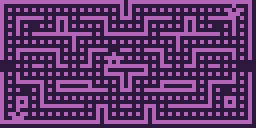<p class="env-name">Blinky</p><p class="env-category">Puzzle</p></a></div>

<div class="env-card"><a href="games.html#brix">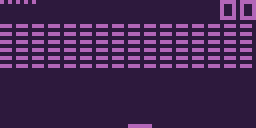<p class="env-name">Brix</p><p class="env-category">Action</p></a></div>

<div class="env-card"><a href="games.html#cavern"><p class="env-name">Cavern</p><p class="env-category">Exploration · 7 levels</p></a></div>

<div class="env-card"><a href="games.html#deep8">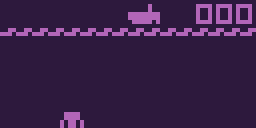<p class="env-name">Deep8</p><p class="env-category">Shooter</p></a></div>

<div class="env-card"><a href="games.html#filter"><p class="env-name">Filter</p><p class="env-category">Action</p></a></div>

<div class="env-card"><a href="games.html#flight-runner"><p class="env-name">Flight Runner</p><p class="env-category">Exploration</p></a></div>

<div class="env-card"><a href="games.html#missile-command">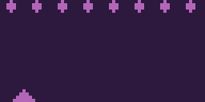<p class="env-name">Missile Command</p><p class="env-category">Strategy</p></a></div>

<div class="env-card"><a href="games.html#pong">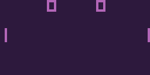<p class="env-name">Pong</p><p class="env-category">Action</p></a></div>

<div class="env-card"><a href="games.html#rocket">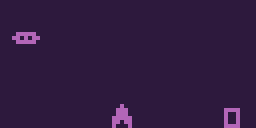<p class="env-name">Rocket</p><p class="env-category">Strategy</p></a></div>

<div class="env-card"><a href="games.html#shooting-stars"><p class="env-name">Shooting Stars</p><p class="env-category">Shooter</p></a></div>

<div class="env-card"><a href="games.html#space-flight">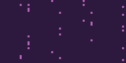<p class="env-name">Space Flight</p><p class="env-category">Exploration · 10 levels</p></a></div>

<div class="env-card"><a href="games.html#spacejam"><p class="env-name">Spacejam!</p><p class="env-category">Exploration</p></a></div>

<div class="env-card"><a href="games.html#squash"><p class="env-name">Squash</p><p class="env-category">Action</p></a></div>

<div class="env-card"><a href="games.html#submarine">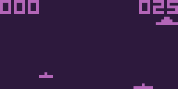<p class="env-name">Submarine</p><p class="env-category">Strategy</p></a></div>

<div class="env-card"><a href="games.html#tank-battle">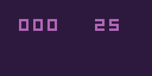<p class="env-name">Tank Battle</p><p class="env-category">Strategy</p></a></div>

<div class="env-card"><a href="games.html#target-shooter">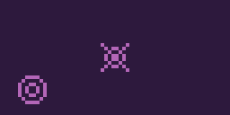<p class="env-name">Target Shooter</p><p class="env-category">Shooter · 3 levels</p></a></div>

<div class="env-card"><a href="games.html#tetris"><p class="env-name">Tetris</p><p class="env-category">Puzzle</p></a></div>

<div class="env-card"><a href="games.html#ufo">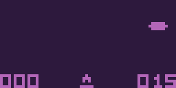<p class="env-name">UFO</p><p class="env-category">Strategy</p></a></div>

<div class="env-card"><a href="games.html#vertical-brix">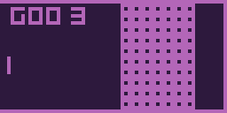<p class="env-name">Vertical Brix</p><p class="env-category">Action</p></a></div>

<div class="env-card"><a href="games.html#wipe-off"><p class="env-name">Wipe Off</p><p class="env-category">Action</p></a></div>

<div class="env-card"><a href="games.html#worm">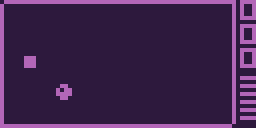<p class="env-name">Worm</p><p class="env-category">Puzzle</p></a></div>

</div>

<a class="see-more" href="games.html">See all game specifications →</a>

---

## Common Interface

### Creating an environment

```python
from octax.environments import create_environment

env, metadata = create_environment("brix")

# With rendering
env, metadata = create_environment(
    "brix",
    render_mode="rgb_array",
    render_scale=8,
    color_scheme="octax",
)
```

### Observation Space

Every environment returns `Box(False, True, (frame_skip, 32, 64), bool)`.

The `frame_skip` axis provides temporal context (default: 4) — equivalent to frame-stacking in Atari environments.

### Action Space

`Discrete(len(action_set) + 1)`. The last action is always a **no-op**. Each game automatically restricts the action space to the keys it actually uses.

### Reward

`reward_t = score(state_t) − score(state_{t−1})` — score delta per step.

### Constructor arguments

| Argument | Default | Description |
|---|---|---|
| `max_num_steps_per_episodes` | `4500` | Steps before truncation |
| `instruction_frequency` | `700` | CHIP-8 CPU speed (Hz) |
| `fps` | `60` | Frame rate |
| `frame_skip` | `4` | Stacked frames in observation |
| `disable_delay` | `False` | Disable delay/sound timers |
| `render_mode` | `None` | `"rgb_array"` or `None` |
| `render_scale` | `8` | Pixel upscale factor |
| `color_scheme` | `"classic"` | Colour palette |

```{toctree}
:hidden:

games
```
