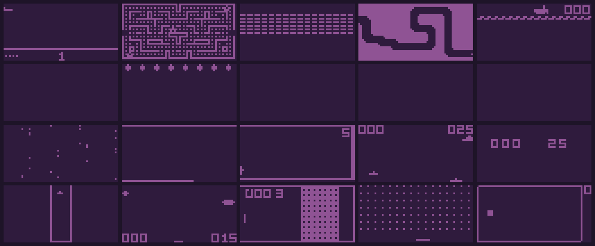

<h1 align="center">Octax Documentation</h1>

<p align="center"><strong>Accelerated CHIP-8 Arcade Environments for Reinforcement Learning in JAX</strong></p>

<p align="center">
  
</p>

<p align="center">Octax provides high-performance CHIP-8 arcade game environments for reinforcement learning research. The library implements a fully vectorized CHIP-8 emulator in JAX, enabling orders-of-magnitude speedups over CPU-based emulators while maintaining perfect fidelity to original game mechanics.</p>

## Features

- **GPU acceleration**: End-to-end JAX implementation runs thousands of game instances in parallel
- **Massive speedups**: 14× faster than CPU-based alternatives at high parallelization
- **Authentic games**: Perfect fidelity to original CHIP-8 mechanics across 20+ games
- **Easy integration**: Compatible with Gymnasium and popular RL frameworks

## Quick links

```{toctree}
:maxdepth: 2
:caption: User Guide

installation
tutorials/index
api/index
```

## Citation

If you use Octax in your research, please cite:

```bibtex
@misc{radji2025octax,
    title={Octax: Accelerated CHIP-8 Arcade Environments for Reinforcement Learning in JAX},
    author={Waris Radji and Thomas Michel and Hector Piteau},
    year={2025},
    eprint={2510.01764},
    archivePrefix={arXiv},
    primaryClass={cs.LG}
}
```
