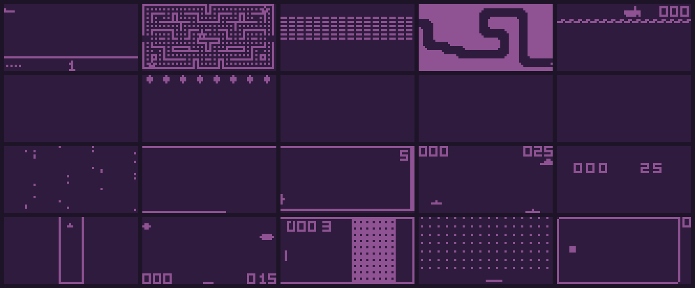

<h1 align="center">Octax Documentation</h1>

<p align="center"><strong>Accelerated CHIP-8 Arcade Environments for Reinforcement Learning in JAX</strong></p>

<p align="center">
  
</p>

<p align="center">Octax provides high-performance CHIP-8 arcade game environments for reinforcement learning research. The library implements a fully vectorized CHIP-8 emulator in JAX, enabling orders-of-magnitude speedups over CPU-based emulators while maintaining perfect fidelity to original game mechanics.</p>

---

## Why Octax?

Modern RL research demands extensive experimentation across thousands of parallel environments. Traditional arcade emulators are CPU-bound, creating a computational bottleneck. Octax solves this with end-to-end JAX — every step, every render, every reset runs on the accelerator.

- **14× faster** than EnvPool at 8192 parallel environments
- **350,000 steps/second** on a single RTX 3090
- **20+ classic games** across puzzle, action, strategy, exploration, and shooter genres
- **Gymnax-compatible** interface for seamless integration with JAX RL frameworks
- **Modular design** — add your own CHIP-8 game in under 20 lines of Python

---

## Quick links

```{toctree}
:maxdepth: 2
:caption: Getting Started

installation
tutorials/index
```

```{toctree}
:maxdepth: 2
:caption: Environments

environments/index
environments/games
```

```{toctree}
:maxdepth: 2
:caption: API Reference

api/index
api/emulator
api/env
api/rendering
api/wrappers
```

```{toctree}
:maxdepth: 1
:caption: Development

contributing
faq
changelog
```

---

## Citation

If you use Octax in your research, please cite:

```bibtex
@misc{radji2025octax,
    title={Octax: Accelerated CHIP-8 Arcade Environments for Reinforcement Learning in JAX},
    author={Waris Radji and Thomas Michel and Hector Piteau},
    year={2025},
    eprint={2510.01764},
    archivePrefix={arXiv},
    primaryClass={cs.LG}
}
```
